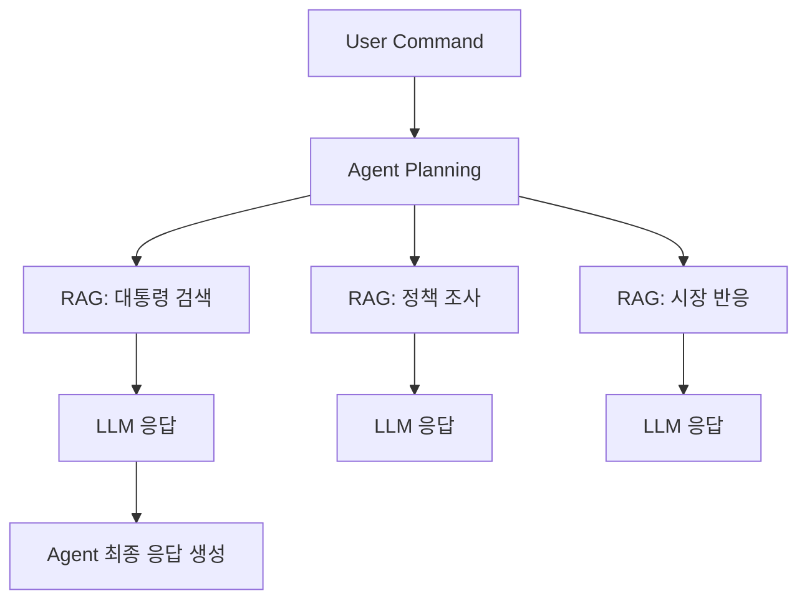

## 📌 SECTION 1. AI 에이전트란?

AI 에이전트(AI Agent)란 **사람의 개입 없이 스스로 작업을 수행하고 결정**을 내리는 프로그램입니다.

> 사용자 명령을 해석하고, 계획을 수립하고, 작업을 실행하는 것이 핵심 역할입니다.

---

## ⚙️ SECTION 2. AI 에이전트의 핵심 속성

### 1. 자동화
- 반복적이고 단순한 작업을 자동으로 수행
- 사람이 개입하지 않아도 명령 해석 → 계획 수립 → 실행까지 수행

### 2. 효율성
- **시간과 비용을 절감**
- 검색, 데이터 분석, 보고서 작성 등에서 **빠르고 정확함**

### 3. 자율성
- 사람 지시 없이도 스스로 판단해 작업
- 오류 발생 시 재계획 가능

> ✅ 요약: AI 에이전트는 사람이 개입하지 않아도 자율적으로 동작할 수 있는 **지능형 프로그램**

---

## 📊 SECTION 3. LLM, RAG, AI 에이전트 비교

| 구성요소 | LLM | RAG | AI 에이전트 |
|----------|-----|-----|--------------|
| 역할 | 두뇌(Brain) | 정보 수집(Information Source) | 작업 관리자(Task Manager) |
| 기능 | 질문 응답, 자연어 처리 | 외부 데이터에서 검색 | 목표 설정, 계획 수립, 실행 |

---

## 📎 예시: 2024 미국 대선 정책 조사 작업 분해

> 사용자 질문: "2024년 미국 대통령이 누가 될지 예측하고, 정책 반응을 분석해줘."

### 🔄 하위 작업 분해 (LLM + RAG + Agent 협업)

1. 사용자 명령 수신 → `에이전트`
2. 계획 수립 → `에이전트`
3. "2024년 미국 대통령" 검색 → `RAG`
4. 응답 전달 → `LLM`
5. 경제 정책, 시장 반응 검색 → `RAG`
6. 결과 정리 → `LLM`
7. 최종 응답 생성 → `LLM`

---

## 🧠 핵심 정리

- AI 에이전트는 **작업을 나누고 분리**, 실패한 작업만 재계획하며 성능을 지속 향상시킴
- LLM, RAG, Agent는 **분업 협업 구조**로 유기적으로 작동
- **복잡한 문제를 단순화**하여 해결 가능
