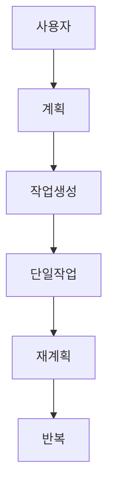
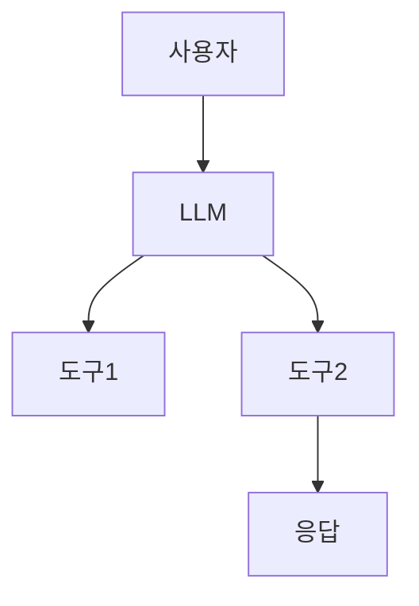
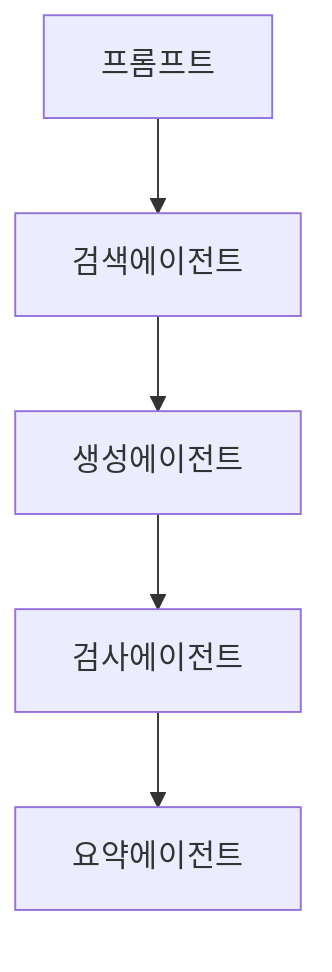

# 📘 AI 에이전트 설계 및 프레임워크 개요

AI 에이전트는 LLM을 중심으로 계획, 실행, 기억, 프로필을 통해 자율적으로 작동합니다. 이 README는 이미지 자료를 바탕으로 핵심 내용을 시각적으로 정리한 것입니다.

---

### CHAPTER 6 📘 AI 에이전트 설계 및 프레임워크 개요

## 📌 1. AI 에이전트의 구성 요소

```
+-------------+
|   Profile   |
+-------------+
      ▲
+-------------+
|   Memory    |
+-------------+
      ▲
+-------------+
|   Action    |
+-------------+
      ▲
+-------------+
|  Planning   |
+-------------+
      ▲
+-------------+
|    LLM      |
+-------------+
```

- **LLM**: 자연어 이해, 텍스트 생성, 의사결정
- **Planning**: 목표 설정, 작업 분해, 우선순위 선정
- **Action**: 실행 API 및 도구 호출
- **Memory**: 대화 기록 기억 (STM, LTM)
- **Profile**: 스타일, 윤리, 지식 기반 정의

---

## 🧠 2. AI 에이전트의 동작 방식

```
사용자 명령 → 계획 수립 → 작업 수행 → 결과 저장 → 응답 생성
```

- 입력: 사용자 질의
- 계획: 문제 해결을 위한 작업 정의
- 실행: 웹검색, DB조회, API호출
- 기억: 결과를 메모리에 저장
- 응답: LLM + 프로필 기준 출력 생성

---

## 🤖 3. 에이전트의 유형

| 유형 | 설명 | 특징 |
|------|------|------|
| 단순 반응형 | 조건-실행 규칙 기반 | 빠른 반응, 낮은 신뢰성 |
| 모델 기반 | 상태 고려 | 경험 기반의 유연한 반응 |
| 목표 기반 | 최적 경로 탐색 | 탐색 알고리즘 활용 |
| 유틸리티 기반 | 선택지 평가 | 복잡한 환경 대응 |
| 학습형 | 피드백 기반 학습 | 스스로 성능 향상 |
| 계층형 | 역할 분리 구조 | 공정 관리 등에 적합 |

---

## 🧭 4. 설계 패턴

### 4.1 반응 패턴

- 초기 응답 생성 → 자기 평가 → 수정 → 종료
- 장점: 정확성 개선, 단점: 복잡성 증가

```
[Generation] → [Self-assessment] → [Reflected Answer]
```

---

### 4.2 계획 패턴

- 문제 해결을 위한 전체 전략 수립
- 작업(Task) 단위로 실행



---

### 4.3 도구 사용 패턴

- 외부 시스템(예: Bing, Google)을 통합
- 실시간 정보에 접근 가능



---

### 4.4 멀티에이전트 패턴

- 역할별로 다양한 에이전트 구성
- 병렬 작업, 유연성, 확장성 제공



---

### 4.5 CoT 프롬프팅 패턴

- 사고 단계 유도 → 더 정확한 응답 생성

```text
질문 → 추론1 → ... → 추론N → 응답
```

---

## 🧰 5. 프레임워크별 특성

### 오토젠 (AutoGen)

- 멀티에이전트 기반
- **UserProxy ↔ Assistant ↔ LLM** 구조
- 자동화된 상호작용 흐름

### 랭체인 (LangChain)

- 체인 구성 및 도구 사용에 특화
- Prompt, Tool, Agent, Memory 등 구성

### 랭그래프 (LangGraph)

- 상태 기반 워크플로우 설계
- **Replan / Iterate / Branch** 지원

### 크루AI (CrewAI)

- 팀 기반 협업 프레임워크
- 역할(role), 목표(goal), 도구(tools) 설정

### 라마인덱스 (LlamaIndex)

- LLM ↔ 외부 데이터 연동
- PDF, DB, 웹사이트 등 문서 검색 지원

---

## 📄 AutoGPT 작동 예시

```
목표: 다이어트 식단 계획 후 PDF 저장
1단계: 트렌드 검색
2단계: 식단 생성
3단계: PDF 변환
4단계: 사용자에게 결과 전달
```

- 장점: 자동 반복 처리
- 단점: 통제 어려움, 보안 문제 발생 가능
