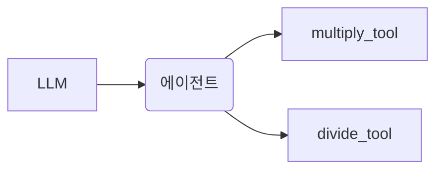

### 📦 6. LlamaIndex 에이전트 구현

---

### ➗ 수학 계산 에이전트



- 도구: `FunctionTool`로 multiply/divide 함수 등록
- 프롬프트 실행 → 최종 응답 생성

---

### 📄 PDF 문서 기반 RAG 구현


- `llama_index`, `python-dotenv` 설치
- `VectorStoreIndex` 기반 문서 임베딩 후 질문 응답

---

## 🧭 7. Google Drive와 연동하여 PDF 임베딩

1. Drive 마운트
2. 파일 경로 복사
3. `SimpleDirectoryReader`로 데이터 로딩
4. `query_engine.query()`로 응답 생성

---

## ❓ 질의-응답 시스템 구성

```python
query_engine = SubQuestionQueryEngine.from_defaults(...)
response = query_engine.query("한국형 스마트팜을 구축하기 위해 필요한 기술은?")
```

> ✅ SubQuestion 기반으로 하위 질문 분리 후 병합된 응답 제공

---

## 📌 설치 라이브러리 요약

```bash
pip install langchain openai wikipedia langchain-community llama-index python-dotenv
```

---

## 📚 참고 구성

- 📖 그림: 구조도, 실행 흐름도 (mermaid)
- 💬 실습: 코드, 설명결과 포함
- 🛠 도구: LangChain Tools, OpenAI API, LangSmith, DuckDuckGo, Wikipedia 등

---

